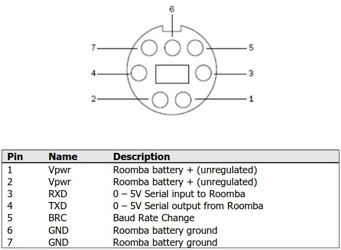

# ESP32 Roomba

ESP32 Controlled iRobot Roomba using iRobot® Create® 2 Open Interface 

## Features

- Control Roomba using ESP32 over WiFi with websocket
- Retrieve sensor data from Roomba
- Control Roomba using Web Interface

## Requirements

- ESP32 (I used ESP32-CAM)
- Compatible Roomba (I used Roomba 564)
- Voltage Regulator (To use unregulated battery voltage from Roomba to 5V for ESP32)
- Arduino IDE

## Wiring



- Connect Roomba BRC (Pin 5) to ESP32 (Pin 14)
- Connect Roomba RXD (Pin 3) to ESP32 TX2 (Pin 15)
- Connect Roomba TXD (Pin 4) to ESP32 RX2 (Pin 16)
- Connect Roomba GND (Pin 6 or 7) to Voltage Regulator Input GND and Output GND to ESP32 GND
- Connect Roomba Vpwr (Pin 1 or 2) to Voltage Regulator Input Vin and Output Vout to ESP32 5V

## Configuration

Create a config.h file in the same directory as esp32-roomba.ino and add your WiFi SSID and Password:

```cpp
#ifndef CONFIG_H
#define CONFIG_H

const char* ssid = "YourSSID";
const char* password = "YourPassword";

#endif // CONFIG_H
```

## Flashing

Upload the code to ESP32 using Arduino IDE

## Usage

Open the Web Interface in your browser by opening the html file, enter the IP address of your ESP32 and click Connect
